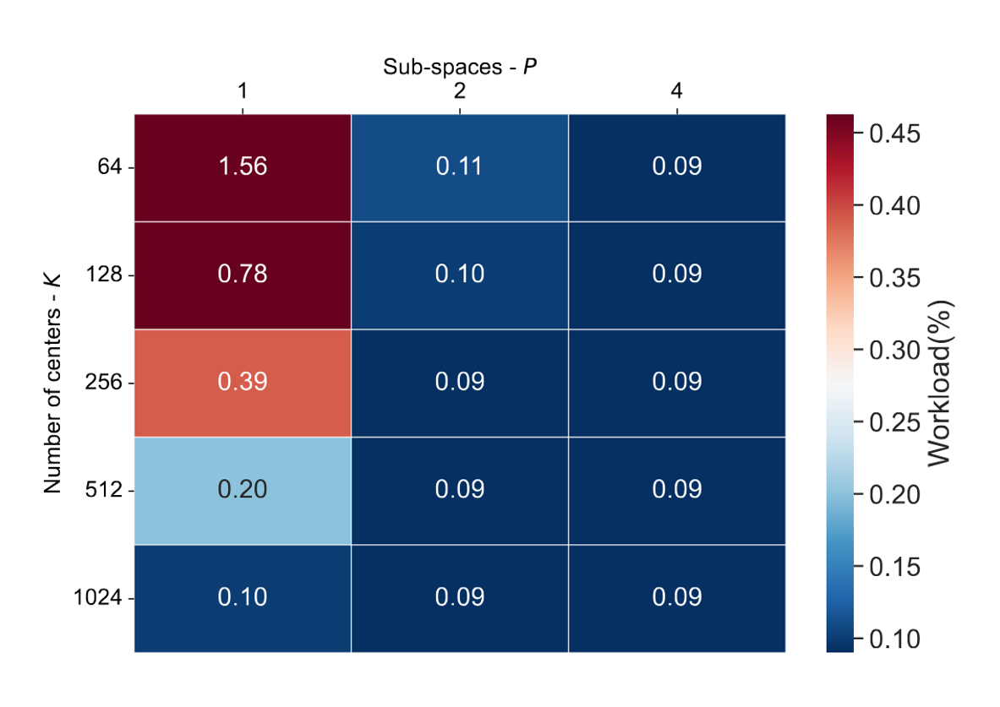

# Stable-Face-Hashing

Refactored code used in the paper "Stable hash generation for efficient privacy-preserving face identification" (TBIOM 2021, Osorio-Roig et al. (https://ieeexplore.ieee.org/abstract/document/9499112)). A summary of the paper can be found at the end of this README.

### Face Hashing


# Abstract 
The development of large-scale facial identification systems that provide privacy protection of the enrolled subjects represents an open challenge. In the context of privacy protection, several template protection schemes have been proposed in the past. However, these schemes appear to be unsuitable for indexing (workload reduction) in biometric identification systems. More precisely, they have been utilised in identification systems performing exhaustive searches, thereby leading to degradations of the computational efficiency. 

In this work, we propose a privacy-preserving face identification system which utilises a Product Quantisation-based hash look-up table for indexing and retrieval of protected face templates. These face templates are protected through fully homomorphic encryption schemes (FHE), thereby guaranteeing high privacy protection of the enrolled subjects. For the best configuration, the experimental evaluation carried out over closed-set and open-set settings shows the feasibility of the proposed technique for the use in large-scale facial identification systems: a workload reduction down to 0.1% of a baseline approach performing an exhaustive search is achieved together with a low pre-selection error rate of less than 1%. In terms of biometric performance, a False Negative Identification Rate (FNIR) in range of 0.0% - 0.2% is obtained for practical False Positive Identification Rate (FPIR) values on the FEI and FERET face databases. In addition, our proposal shows competitive performance on unconstrained databases, e.g., the LFW face database. To the best of the authors' knowledge, this is the first work presenting a competitive privacy-preserving workload reduction scheme which performs template comparisons in the encrypted domain.

# Citation

If you use this code in your research, please cite the following paper:

```{bibtex}

@article{OsorioRoig-StableHashFaceIdentification-TBIOM-2021,
 Author = {D. Osorio-Roig and C. Rathgeb and P Drozdowski and C. Busch},
 File = {:https\://cased-dms.fbi.h-da.de/literature/OsorioRoig-StableHashFaceIdentification-TBIOM-2021.pdf:URL},
 Groups = {TReSPAsS-ETN, ATHENE, NGBS},
 Journal = {Trans. on Biometrics, Behavior, and Identity Science ({TBIOM})},
 Keywords = {Face Recognition, Workload Reduction, Indexing, Data Privacy, Homomorphic Encryption},
 Month = {July},
 Number = {3},
 Pages = {333--348},
 Title = {Stable Hash Generation for Efficient Privacy-Preserving Face Identification},
 Volume = {4},
 Year = {2021}
}
```

# Contributions
1- A hash generation scheme based on a Product Quantisation (PQ) which generates stable hash codes from faces. These hashes are used for indexing a face database, i.e., to construct a hash look-up table. Facial references within the database are protected through FHE. At the time of authentication, face hashes are employed to speed up the retrieval, i.e., to return a candidate short-list. In contrast to existing works in the field, the retrieval of the candidate short-list does not require a one-to-many search, but can be directly obtained via the hash look-up table, i.e., exact matching with computational complexity of O(1). This is possible since obtained hash codes are highly stable, which further allows for a protection thereof using conventional cryptographic methods. Finally, FHE-based comparisons are carried out in the protected domain for a small fraction of facial references.  Thereby, the proposed approach reduces the overall computational workload of a face-based identification system while the indexing and retrieval is done in a privacy-preserving way.

2- A thorough analysis of several clustering techniques to obtain a stable hash generation scheme. The experimental results show the capability of graph- and density-based clustering algorithms to build a stable and compact hash code which can be successfully employed for face identification.  In addition, the search of different sub-spaces offered by the PQ- and clustering-based combination allows achieving a good trade-off between efficiency and biometric performance. Moreover, a detailed discussion on the protection of generated hash codes with conventional cryptographic methods is given.

3- A comprehensive performance evaluation based on standardised metrics of the [ISO-IEC-19795-1-060401](https://www.nist.gov/system/files/documents/2020/12/15/340_1_mansfield_panel_ibpc.pdf) carried out over challenging closed-set and open-set scenarios on three public face databases, i.e., [FEI](https://www.sciencedirect.com/science/article/abs/pii/S0262885609002613), [FERET](https://www.nist.gov/itl/products-and-services/color-feret-database), and [LFW](https://vis-www.cs.umass.edu/lfw/). 


# Installation

1- download databases e.g. FEI in https://fei.edu.br/~cet/facedatabase.html 

Example of the databases used on this proposal:


2- ```pip install scikit-learn``` to work with:
- ```sklearn.cluster import AffinityPropagation (AP)```
- ```sklearn.mixture import GaussianMixture (GMM)```
- ```sklearn.cluster import KMeans (k-means)```
- ```sklearn_extra.cluster import KMedoids (k-medoids)```

3- ```pip install numpy```

4- install and build the library [SEAL](SEAL.zip) in C++ for python. Seal builds to ```BFV``` as encoding scheme

5- ```import seal``` from python to work with homomorphic encryption

6- Details to build [SEAL] are in the folder [SEAL](README_build.md)

# Pipeline

- Execute the pipeline according to the protocol used for each database ([FEI], [FERET], and [LFW]), code of example is [available for the database FEI](example_FEI_database):

    - Example: [Affinity Propagation](example_FEI_database/FEI-open_set_affinity_256_secure.py) and [GMM](example_FEI_database/FEI-open_set_gmm_256_secure.py) using secure system with Homomorphic Encryption.
    
- Depending on type of unsupervised clustering technique utilised, the code should be executed in the unprotected or secure domain.

Project Organization
------------
    ├── LICENSE
    ├── README.md          <- The top-level README for developers using this project.
    ├── README_build.md    <- The top-level README for building SEAL in python.
    ├── images             <- Figures for the README   
    ├── secure_systems     <- Prepare secure system
        ├── encyption        <- Forlder for functions of encryption process
        ├── SecureHashIdentificationSystem  <- Secure enrolment and search processes
        ├── TripleHashSystem  <- Unprotected enrolment and search processes
        ├── example_thresholds <- File for threshold selection of a DB 
    ├── quanrisation           <- Functions to design hash by clustering techniques
        ├── ...                <- Define X clustering technique
        ├── kmean_quantisation <- Design of Kmean-based hash  
    ├── example_FEI_database   <- Define the main of the indexing scheme
    ├── SEAL.zip               <- Library to build for [HE](https://github.com/Lab41/PySEAL)


# Highlight

    1- Use [main_open_set_affinity_secure](example_FEI_database/FEI-open_set_affinity_256_secure.py)

    2- Use [main_open_set_affinity_unprotected](example_FEI_database/FEI-open_set_affinity_256_unprotected.py)

    3- Use [main_open_set_gmm_secure](example_FEI_database/FEI-open_set_gmm_256_secure.py)

    4- Use [main_open_set_gmm_unprotected](example_FEI_database/FEI-open_set_gmm_256_unprotected.py)

## Overview of the Clustering- and PQ-based proposed hash generation scheme


# Description of parameters

- '-e', '--embeddings', help='path to the face embeddings extracted'
- '-p', '--params', help= 'set path to parameters corresponding to homomorphic encryption'
- '-q', '--precision', help= 'set value to parameters corresponding to homomorphic encryption'
- '-vm', '--value-modulus', help= 'set value to parameters corresponding to homomorphic encryption, polynomial computation'
- '-vc', '--value-coeff-modulus', help= 'set value to parameters corresponding to homomorphic encryption, security level, lowest--> more efficient'
- '-pm', '--plain-modulus', help='set value to parameters corresponding to homomorphic encryption'
- '-bit', '--descomp-bit-count', help='set value to parameters corresponding to homomorphic encryption'
- '-o', '--output', help='path to the output'
- '-n', '--name', help='name of the model to be generated in training'
- '-k', '--k-fold',  help='number of rounds to execute in k-folds'
- '-s', '--sub-spaces', help='number of sub-spaces to be set on the face embeddings, i.e. 1, 2, or 4'.


### Experiments

#### Impact of the quality over the LFW database in terms of hit-rate for the GMM-based scheme using K centers and P = 1


- For higher quality thresholds the number of samples becomes too low to obtain meaningful results.

- The hit-rates improve with K for those ranges including poor quality images. As expected, the robustness of the proposed hash generation scheme improves with image quality.

#### Relation between the number of enrolled subjects and average number of comparisons.


- Reveals the linear relation between N (number of enrolled subjects) and p (penetration rate).

#### Computational Workload Reduction.



- Computational Workload depends on the number of sub-spaces.

- Best Workload is 0.09% for a constant 𝑁 (i.e. number of enrolled subjects) which represents a 99% of search space reduced with respect to baseline 100%.
